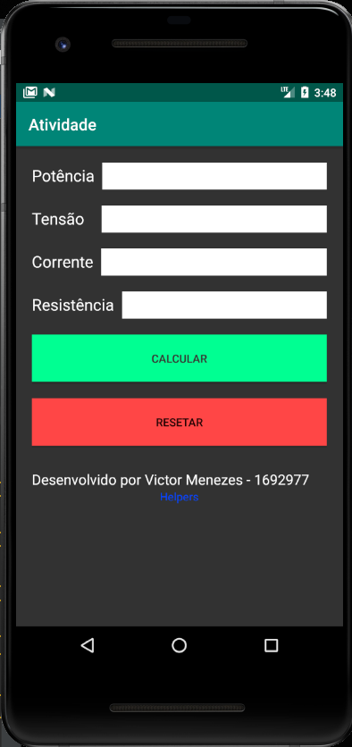
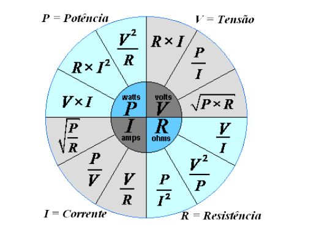

# Projeto Android Studio

# Proposta

 um APP que será responsável por calcular as grandezas
físicas como a tensão, corrente e a resistência elétrica por meio das leis de Ohm.

o usuário irá digitar duas grandezas e o app será responsável por gerar as outras duas.

exemplo: o usuário digita a potência e a tensão, com base nesses dois valores o app vai trazer o resultado da corrente e resistência.

# Fórmulas

